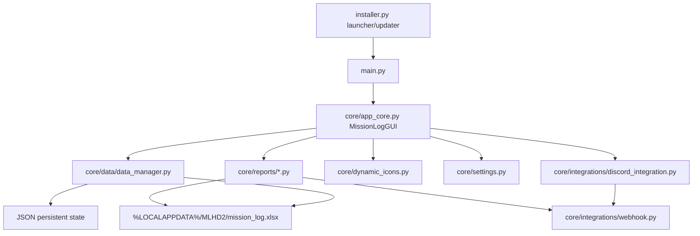

# MLHD2

# Join our Discord if you need help.
https://discord.gg/U6ydgwFKZG

Helldivers 2 Mission Log Manager for recording deployments, building summaries, and sharing mission data to Discord.

## Quick Start (Launcher)

1. Download launcher: https://hdmlm.github.io/MLHD2/download.html
2. In the launcher, click **Update from GitHub**
3. In the launcher, click **Verify Integrity**
4. In the launcher, click **Initiate**

## What MLHD2 Does

MLHD2 is a desktop Python application (Tkinter) that helps you maintain a structured local mission history and optionally publish rich Discord embeds.

Core workflow:
1. Capture mission details in the main app.
2. Persist entries locally in an Excel mission log.
3. Enrich data with icons, color mappings, and metadata.
4. Send mission updates and report-style summaries to one or more webhooks.

## Key Features

- Mission logging to local Excel with schema normalization and cache-aware data access.
- First-run onboarding + settings validation (Discord ID/platform checks before app use).
- Discord webhook integration with timeout, retry/backoff, and user-friendly error classification.
- Discord Rich Presence integration (optional via `discord-rpc`).
- Dynamic icon handling for planets and visual assets.
- Multiple report/export scripts (mission summaries, faction snapshots, favourites, weekly summaries, achievements, observation mode).
- Export Viewer GUI for browsing/filtering logged data and pushing exports.
- Optional diagnostics dump for support reporting.
- Build pipeline for packaged launcher executable.

## Architecture (High-Level)

MLHD2 is organized around a Tkinter desktop app with separate layers for runtime paths/config, data persistence, Discord integration, and reporting modules.



### Module Responsibilities

- **UI + orchestration**: `main.py`, `core/app_core.py`
- **Settings/onboarding**: `core/settings.py`, `core/config/settings_shared.py`
- **Persistence/data services**: `core/data/data_manager.py`, `core/schema/mission.py`
- **Discord delivery**: `core/integrations/discord_integration.py`, `core/integrations/webhook.py`
- **Asset/icon systems**: `core/icon.py`, `core/dynamic_icons.py`, `core/utils.py`
- **Exports/reports**: `core/reports/` scripts + `core/reports/exportGUI.py`
- **Runtime infra/logging**: `core/infrastructure/runtime_paths.py`, `core/infrastructure/logging_config.py`

## Requirements

- Windows environment recommended (launcher/build pipeline and `%LOCALAPPDATA%` paths are Windows-oriented)
- Python `3.10.x` + `pip` (only needed for manual/source install)

## Installation

Recommended (most users):

- Download and install via the official launcher page:
	- https://hdmlm.github.io/MLHD2/download.html

Alternative (manual/source install):

From repository root:

```bash
python -m venv .venv
.venv\Scripts\activate
pip install -r requirements.txt
```

## Running the Application

### Recommended launcher flow

Install and start from:

- https://hdmlm.github.io/MLHD2/download.html

### Manual source run

```bash
python main.py
```

### Local launcher script (source checkout)

```bash
python installer.py
```

The launcher handles update/dependency orchestration and packaged-launch scenarios.

## First-Run Setup

On startup, MLHD2 validates settings data and will open the settings UI if required values are missing/invalid.

Expected first-run actions:
- Set Helldiver/platform identity data.
- Set a valid Discord UID.
- Configure webhook destinations as needed.
- Complete onboarding prompts.

## Data & File Locations

### Runtime mission logs

Stored under local app data:
- `%LOCALAPPDATA%\MLHD2\mission_log.xlsx`

### Configuration and state

Repository/runtime files include:
- `JSON/settings.json`
- `JSON/DCord.json`
- `JSON/persistent.json`
- `JSON/streak_data.json`
- `orphan/config.config`
- `orphan/icon.config`

## Discord Integration

MLHD2 supports:
- One or more webhook URLs.
- Structured embeds with icon/color mappings.
- Classified failure messages for common HTTP/network cases.
- Retry/backoff behavior for transient errors.

If Discord posting fails, check webhook URL validity, permissions, and network connectivity first.

## Reporting & Export Modules

The project includes specialized report/export scripts in `core/reports/`:

- `sub.py` – comprehensive mission summary export.
- `dossier.py` – dossier-style export flow.
- `faction.py` – faction-focused summary exports.
- `favourites.py` – most-used/most-frequent patterns.
- `expWeek.py` – recent (7-day) summary export.
- `Achievements.py` – achievement-style aggregate milestones.
- `observation.py` – observation-mode output path.
- `exportGUI.py` – interactive export viewer UI.

Most report scripts read the local Excel log, build derived metrics, and publish embeds using configured webhooks.

## Diagnostics (Optional)

Generate a diagnostics JSON dump for issue reports:

```python
from core.data.diagnostics import generate_diagnostics_dump
print(generate_diagnostics_dump())
```

This collects platform/environment details and basic file validity/existence checks.

## Build & Distribution

See:
- `docs/BUILD_AND_DISTRIBUTION.md`
- `docs/RELEASE_CHECKLIST.md`

Quick build path (Windows):

```bat
cd tools
build.bat
```

Artifact output:
- `tools/Built/MLHD2-Launcher.exe`

## Troubleshooting

- **Settings loop on startup**: verify JSON files are valid and onboarding fields are complete.
- **No Discord posts**: validate webhook URLs, channel permissions, and connectivity.
- **Excel not updating**: confirm the file is not locked by another process and write permissions are available.
- **Missing icons/assets**: ensure media/JSON/orphan resources are present in expected relative paths.

## Privacy Notes

Mission data is logged locally first. Outbound data is limited to webhook payload content you configure.

Avoid including sensitive personal information in mission notes or profile fields if privacy is a concern.

## Contributing

When opening issues/PRs, include:
- OS + Python version
- Reproduction steps
- Expected vs actual behavior
- Relevant traceback/log excerpts

---

Not affiliated with Arrowhead Game Studios or Sony. Use at your own risk and respect game/community terms.

